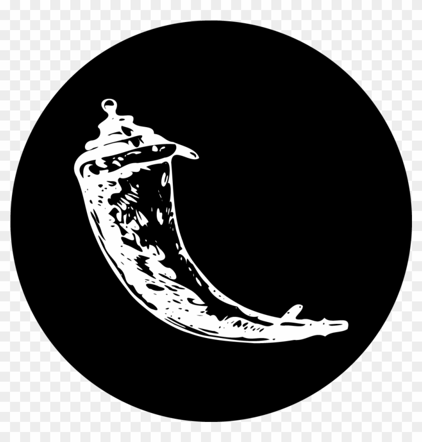

<header style="margin-bottom: 16px;">
    <h1 style="margin: 0; padding: 0; text-align: center; text-decoration: none; line-height: 1.5;"> Board of European Students of Technology in Vinnytsia </h1>
</header>

<section style="display: flex; flex-direction: column; gap: 16px; margin-bottom: 16px;">
    <h1 style="margin: 0; padding: 0; font-size: 1.25rem; text-align: center; text-decoration: none; line-height: 1.5;">LBG BEST-Vinnytsia</h1>
    

        BEST, Board of European Students of Technology is a voluntary and politically unaffiliated non-profit
        organisation.
        Since 1989 we provide communication, co-operation and exchange possibilities for students all over Europe.
    

    

        BEST Vinnytsia is a local group of BEST founded in 2010.
        It organizes events aimed at student development and has corresponding departments.
        The IT department provides training and development for members of BEST Vinnytsia in the IT field.
    

</section>

<section style="display: flex; flex-direction: column; gap: 16px; margin-bottom: 16px;">
    <h1 style="margin: 0; padding: 0; font-size: 1.25rem; text-align: center; text-decoration: none; line-height: 1.5;">Technologies in LBG</h1>
    

        
        
        
        
        
        
        
        
        
        
        
        
        
    

</section>

<section style="display: flex; flex-direction: column; gap: 16px; margin-bottom: 16px;">
    <h1 style="margin: 0; padding: 0; font-size: 1.25rem; text-align: center; text-decoration: none; line-height: 1.5;">Socials of BEST Vinnytsia</h1>
    

        
        
        
        
        
    

</section>
